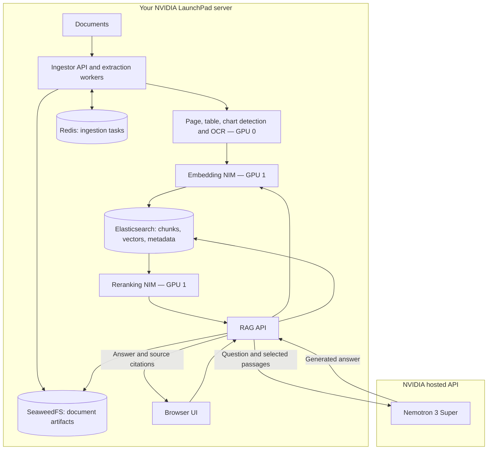

# Understanding this deployment

> Checkout note: this document preserves the earlier RAG design and verification history. Its `scripts/` launchers and `tests/` suites are absent from this checkout; their commands are historical, not runnable setup instructions. See [the backend guide](../README.md) for the checked-in layout and Patient360 Compose commands.

RAG means **retrieval-augmented generation**: first find relevant information in your documents, then ask a language model to answer using those passages. Uploading documents creates a searchable index; it does not train or fine-tune the language model.

Your linked [NVIDIA diagram](https://github.com/NVIDIA-AI-Blueprints/rag/blob/main/docs/assets/arch_diagram.png) describes application services. LaunchPad is the server environment underneath them. Multiple boxes can run as separate containers on the same physical machine.

## The two workflows

**Ingestion:** upload a document; extract its text and tables/charts; split extracted content into chunks; embed each chunk as a numeric vector; persist chunks, vectors, metadata, and applicable artifacts. Redis helps coordinate background ingestion tasks. OCR reads text rendered inside images or scanned pages.

**Answering:** embed the question locally; find similar document chunks in Elasticsearch; score them again with a local reranker; send the question and selected passages to the hosted LLM; return the generated answer with source citations. Citations help you inspect the evidence but do not guarantee correctness.

For example, uploading `backend/examples/demo.txt` indexes the phrase “ALPINE-742.” Asking “What is the project test code?” should retrieve that passage and return the code with a citation to the document.

## What the NVIDIA terms mean

| Term | Meaning here |
|---|---|
| GPU | Hardware that accelerates neural-network computations |
| NVIDIA driver | Host software that lets applications use the GPUs |
| CUDA | NVIDIA's GPU computing platform; the containers supply their required user-space libraries |
| NVIDIA Container Toolkit | Lets Docker expose GPUs to selected containers |
| NIM | A packaged NVIDIA model server with an API; used here for embeddings, reranking, OCR, and extraction |
| NGC / `nvcr.io` | NVIDIA's catalog and container registry; the key allows image/model downloads |
| NeMo Retriever / NV-Ingest | Document extraction and retrieval components in the blueprint |
| Docker Compose | Starts this application's cooperating containers on one server |
| Kubernetes / GPU Operator | An alternative orchestration platform already installed here; it is not used by this Compose deployment |
| Vector database | Stores vectors alongside document chunks so the system can search by semantic similarity |
| Object store | Stores binary artifacts via an S3-compatible API; S3-compatible does not mean AWS-hosted |

The GPU Operator manages GPU integration for Kubernetes. It does not manage these Docker Compose containers. Avoid scheduling other GPU-intensive workloads on the same GPUs without accounting for their combined memory use.

## Mapping the diagram to actual services

| Diagram component | This deployment | Location |
|---|---|---|
| User / query processing | `rag-frontend`, `rag-server` | Local CPU |
| Ingestion pipeline | `ingestor-server`, `nv-ingest-ms-runtime`, Redis | Local CPU |
| Page elements | `page-elements` | GPU 0 |
| Graphic elements | `graphic-elements` | GPU 0 |
| Table structure | `table-structure` | GPU 0 |
| OCR | `nemotron-ocr` | GPU 0 |
| Nemotron Embed | `nemotron-vlm-embedding-ms` | GPU 1 |
| Nemotron Rerank | `nemotron-ranking-ms` | GPU 1 |
| Nemotron LLM | `nvidia/nemotron-3-super-120b-a12b` | NVIDIA-hosted API |
| Vector database | Elasticsearch, CPU indexing/search | Local Docker volume |
| Object store | SeaweedFS | Local Docker volume |
| Data catalog | Collection/document metadata exposed by the blueprint APIs | Local storage; no separate catalog container |
| Safety / reflection | Optional, disabled initially | Not deployed |
| VLM image captioning / speech | Optional, disabled initially | Not deployed |

This is a similar core architecture, not every optional branch of the diagram. Elasticsearch runs without cuVS GPU acceleration. Image captioning and audio are disabled; local OCR, page layout, chart, and table extraction are enabled. The embedding model can handle vision inputs, but using that model does not itself enable the optional image-captioning workflow.

## Hardware and sizing

Inspected on 2026-09-14:

| Resource | Observed |
|---|---|
| GPUs | 2 × NVIDIA H100 NVL, 95,830 MiB each |
| GPU use before deployment | 0 MiB allocated on both GPUs |
| Host memory | About 1 TiB total, 987 GiB available |
| Home filesystem | About 1.7 TiB free |
| Docker filesystem | About 6.9 TiB free |
| Driver | 595.71.05 |
| Docker / Compose | 29.4.3 / v5.5.1 |
| OS | Ubuntu 24.04.3 |
| Kubernetes | One ready node, v1.34.2; GPU Operator installed |

NVIDIA's v2.6.2 default fully local stack requires three H100 GPUs: two for its default large LLM and one for non-LLM models. Your chosen hosted LLM removes that local LLM allocation. We split the non-LLM work across both available GPUs. Exact memory use and model profile compatibility must still be verified when the NIMs start.

NVIDIA's blueprint support matrix names Ubuntu 22.04; this host is 24.04.3. Docker and the NVIDIA runtime are already installed. Treat successful container and pipeline checks on this host as the deployment validation, rather than claiming it exactly matches the published OS baseline.

## Data boundary

Documents, embeddings, retrieved chunks, and extracted artifacts are stored locally. At answer time, questions and selected passages are sent to `https://integrate.api.nvidia.com/v1`. Document summaries, if explicitly requested during upload, also use that hosted LLM and can send additional document content. Summary generation defaults to off.

This is a development setup. The UI/APIs bind to localhost and storage ports are not published on the host. It does not implement application login, per-user document permissions, or a clinical validation process. Begin with the supplied synthetic document. A deployment for real clinical use needs those requirements defined alongside the approved cloud data boundary.

## Reading NVIDIA's code

After `./scripts/rag bootstrap`, inspect `.vendor/nvidia-rag/` in this order:

1. `README.md` and `docs/deploy-docker-self-hosted.md`: the overall system and startup flow.
2. `deploy/compose/nims.yaml`: NVIDIA model containers and GPU reservations.
3. `deploy/compose/vectordb.yaml`: storage services and their volumes.
4. `deploy/compose/docker-compose-ingestor-server.yaml`: upload/extraction service wiring.
5. `deploy/compose/docker-compose-rag-server.yaml`: answer generation and the UI.
6. `src/nvidia_rag/ingestor_server/`: document processing implementation.
7. `src/nvidia_rag/rag_server/`: retrieval and answer generation implementation.
8. `frontend/`: the reference user interface.

Your repository's `backend/deploy/hybrid.env` and `backend/deploy/compose.hybrid.yaml` customize that upstream system without copying or editing its application source.

Sources: [NVIDIA architecture and overview](https://github.com/NVIDIA-AI-Blueprints/rag/tree/v2.6.2), [support matrix](https://github.com/NVIDIA-AI-Blueprints/rag/blob/v2.6.2/docs/support-matrix.md), [model configuration](https://github.com/NVIDIA-AI-Blueprints/rag/blob/v2.6.2/docs/change-model.md), [hosted Nemotron 3 Super](https://build.nvidia.com/nvidia/nemotron-3-super-120b-a12b).
