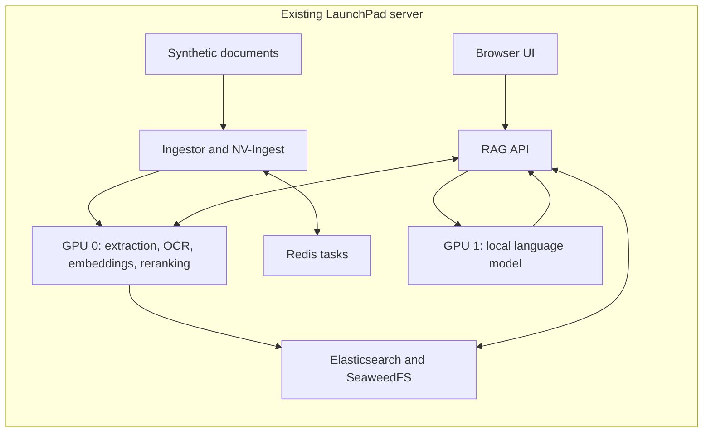

# Fully local RAG deployment: staged plan and acceptance tests

> Checkout note: this document preserves the earlier RAG design and verification history. Its `scripts/` launchers and `tests/` suites are absent from this checkout; their commands are historical, not runnable setup instructions. See [the backend guide](../README.md) for the checked-in layout and Patient360 Compose commands.

Status: **plan and tests prepared; deployment stages have not started**. We will work through one stage at a time, inspect its evidence, and continue only after its gate passes. This planning turn does not authorize running all stages automatically.

The current `scripts/rag` and `backend/deploy/hybrid.env` still implement hosted generation. Their `up`, `access`, `health`, and `auth` paths are not yet the fully local workflow. In particular, do not use the hosted-key prompt as a requirement for this plan. Stage 5 changes those interfaces before they are used for local deployment.

## What we are building

Everything runs on the existing LaunchPad server. No separate Brev/Scaleway machine is needed. Docker Compose manages the application; the installed Docker/NVIDIA runtime is reused.



The complete target has 14 services: seven model containers (six existing retrieval/extraction NIMs plus one LLM), three storage/task services, NV-Ingest, the ingestor API, the RAG API, and the UI. Only the UI and application APIs publish loopback ports. The final LLM endpoint is internal: `http://nim-llm:8000/v1`.

Provisional model: **Nemotron 3 Nano 30B-A3B**, image `nvcr.io/nim/nvidia/nemotron-3-nano:1.7.0-variant`, proposed served identifier `nvidia/nemotron-3-nano`. The served identifier and selected profile must be verified at stage 3. This candidate preserves the goal of using the two existing GPUs; it is not a promise about model quality or memory fit. The original Super model remains an alternative requiring a separate capacity decision.

Initial evaluation assumptions: one concurrent request, an 8192-token context cap where supported, summaries off, and synthetic documents only. We will measure latency rather than invent a production latency target. Optional captioning, VLM generation, audio, reflection, query rewriting, agentic RAG, and guardrails remain disabled for this baseline. Keeping those disabled does not disable local OCR/table/chart extraction.

## Which API key matters?

The key's permissions and account association matter, not its label or which dashboard looks more familiar.

| Purpose | Needed for this plan? | Required access |
|---|---|---|
| Download NVIDIA containers/model artifacts | Yes, for this NIM-based design | A valid NGC key with NGC Catalog permission and entitlement to the selected artifacts |
| Call NVIDIA-hosted generation | No | Public API Endpoints permission is irrelevant to the local generation path |
| Log in to Brev or LaunchPad | Useful for accessing infrastructure | Infrastructure login by itself does not prove registry/image access |
| Authenticate to our eventual application | Separate design decision | An application credential is not an NGC download key |

A single key can support multiple capabilities, but it is not necessary to generate another key if the saved one can download everything required. A successful Docker login alone is insufficient. Model artifacts can be gated separately from container manifests. Downloads may need internet access even when prompts and inference stay local.

If a replacement is needed at stage 2: open [NGC API Keys](https://org.ngc.nvidia.com/setup/api-keys), use the intended organization's account, generate a personal key with **NGC Catalog**, and enter it only through hidden registry credential entry. Do not paste it into this document or chat. The registry-only setup path will preserve existing credentials and will not ask for hosted inference access.

## Stage 1 — Record and protect the starting state

Assistant work: inspect GPU availability, runtime, free disk, project containers, network and volumes; verify the vendor commit; record a baseline without dumping Docker environment variables. Keep the existing storage volumes and model cache. Do not alter Kubernetes, GPU drivers, or unrelated containers.

Checks: `nvidia-smi`; Docker/Compose versions and NVIDIA runtime; free disk for images/cache; container/volume inventory; pinned vendor HEAD and clean tracked vendor source. Reuse `python3 scripts/verify.py preflight` for its existing host checks, but inspect current workload ownership as well as GPU IDs.

Pass: both intended GPUs are available for this project, prerequisites pass, and existing resources are documented. Previous checks found two H100 NVL GPUs with 95,830 MiB each, but that observation must be refreshed before allocation.

Stop: GPU conflict, insufficient disk, runtime failure, or unexpected vendor edits. Resolve the specific issue before creating model containers. Store the baseline under `.data/verification/local/01-baseline/`.

## Stage 2 — Verify download access

Assistant work: provide registry-only setup if necessary; reuse the saved key when valid. Check each pinned target image, including Nano and all six retrieval/extraction NIMs. Record the image reference and status, never the key. Container/model pulls belong to the following stages, so manifest success is only a preliminary gate.

Tests: existing credential preservation/private-file tests and `scripts/image_access.py` against the selected image configuration. A 401/403 means authorization needs investigation; an explicit `Payment Required` is an entitlement denial. A truncated registry token response or timeout is inconclusive. Retry transient errors at most twice in this stage, then record unresolved access rather than repeatedly changing keys.

Pass: required manifests are accessible. Runtime pulls may still expose an artifact-access problem later.

Stop: denied or inconclusive access for a required image. Investigate organization/user/key entitlement mapping or registry availability according to the actual error. No new subscription purchase is presumed.

Latest evidence: Nano, ranking, NV-Ingest, and graphic-elements each succeeded at least once. Other checks returned `unable to decode token response: unexpected EOF`; OCR/page/table access remains inconclusive. Earlier explicit entitlement denials must not be represented as the unchanged current result. See recorded manifest checks (local-only record: `../../.scratch/rag-blueprint-reliability/local-feasibility-access.json`; not published).

## Stage 3 — Prove the local model on GPU 1

Assistant work: prepare an isolated evaluation container named `secure-rag-nim-llm`, using only GPU 1 and the pinned Nano image. Inspect the image's supported launch parameters/profile before setting the context and concurrency limits; do not guess flags. Record the image digest, profile, actual served model ID, launch settings, and startup time. Preserve its downloaded cache. This is an isolated experiment before the full Compose conversion.

Tests already written: `tests/acceptance/test_local_llm.py` checks the container requests only GPU 1, local readiness returns success, `/v1/models` lists the planned model, and a synthetic generation request returns nonempty content with a normal finish without a hosted bearer key.

Run only after the candidate is started at this stage:

```bash
RUN_LOCAL_LLM_ACCEPTANCE=1 python3 -m unittest discover \
  -s tests/acceptance -p test_local_llm.py -v
```

Additional measurement protocol: execute 20 sequential synthetic requests at concurrency 1, include short and near-budget input, record success/error count, elapsed times, and GPU memory before/during/after. Report median and p95 latency; there is no agreed latency SLA yet. Verify the unused GPU is not allocated by this container and no out-of-memory errors occur. The measurement automation is to be added during this stage; the four endpoint tests do not measure performance.

Pass: all four live tests pass and repeated bounded requests complete without memory errors. Confirm the tested H100 NVL profile; documented model-file size is not runtime memory proof.

Stop: image/artifact denial, incompatible profile, allocation of both GPUs, missing model, empty/truncated generation, or out-of-memory. Stop only the evaluation container, preserve its cache/evidence, and revise the candidate/settings. Do not silently switch to hosted generation.

## Stage 4 — Prove all local retrieval services on GPU 0

Assistant work: allocate embedding, reranking, page-elements, graphic-elements, table-structure, and OCR to GPU 0. Reuse the existing storage services and start NV-Ingest/ingestor as needed. Keep the LLM on GPU 1 when checking simultaneous resource fit. Preserve the existing embedding model and its 2048-dimensional index space.

Tests: all six NIM readiness probes succeed together; container GPU reservations match GPU 0; authenticated object storage, Elasticsearch, Redis, embeddings and processing dependency checks succeed. Upload `backend/examples/demo.txt` with summaries disabled. Reject HTTP200 uploads containing failed documents or validation errors. Search with reranking must retrieve `ALPINE-742` from `demo.txt`.

Reuse `scripts/smoke.py --retrieval-only` once the application endpoints/UI proxy it requires are up. Earlier component-only checks use their direct local APIs. Record upload completion, source content, GPU peak memory and errors. Do not infer successful OCR from a text-file upload.

Pass: concurrent model readiness and local ingestion/search work with the LLM also resident. Stop on missing/skipped required dependencies, failed ingestion, wrong embedding dimensions, or memory errors. Rebalance or reduce scope only through an explicit revision of this plan.

## Stage 5 — Integrate the fully local configuration

Assistant work: introduce a dedicated local configuration/overlay and an explicit local launcher mode. Make local mode the documented default for this project; retain previous hybrid files for comparison, not automatic fallback. Wire generation, summary generation and configured helper model URLs to the local LLM. Remove mandatory hosted-key setup and hosted synthetic probes from local mode. Keep NGC download credentials available to the services that need them.

Update the runtime verifier from 13 to 14 expected services for local mode; its existing hybrid expectation cannot be reused unchanged. Keep the upstream vendor source pinned and put adaptation changes in this repository. Update wizard, launcher help, README and deployment runbook together.

Acceptance contract already written: `tests/acceptance/test_local_contract.py` checks exact services/model image, GPU allocation, local generation/helper URLs, empty hosted-inference credential fields, consistent local retrieval/storage, disabled optional features, readiness definitions, private ports and persistent storage.

Render the future local Compose configuration with **dummy credentials** into `/tmp/local-rag-config.json`, then run:

```bash
LOCAL_RAG_CONFIG=/tmp/local-rag-config.json python3 -m unittest discover \
  -s tests/acceptance -p test_local_contract.py -v
```

The local renderer/launcher wiring is not yet implemented. This command evaluates a supplied artifact; it does not create a local configuration. Also add launcher regressions proving local mode does not call the hosted authorization helper and stale `.secrets/llm.env` cannot redirect local inference. These launcher tests must be written alongside that implementation.

Pass: six configuration acceptance tests pass against real Compose output; existing regression tests continue to pass or are explicitly split by mode; local runtime dependency reports include the LLM and every required service. Configured endpoints alone do not prove absence of cloud dependence: complete the stage 6 network test too.

## Stage 6 — Test the complete document-to-answer path

Run `./scripts/rag smoke` through the new local mode. Its existing parser regression tests cover partial ingestion, wrong source, a fact only in citations, and incomplete SSE answers. The live test must create its own synthetic collection and exercise the UI's ingestion/generation proxies.

| Scenario | Required result |
|---|---|
| Known text fact | Generated answer contains ALPINE-742; citation names demo.txt and includes supporting content |
| Unrelated fact absent from the fixture | Manual answer review confirms the model does not invent a document-supported fact; record behavior separately from the deterministic smoke test |
| Scanned synthetic PDF | OCR-derived known fact is searchable and cited |
| Synthetic table/chart PDF | Selected numeric/table/chart facts are extracted, retrieved and cited correctly |
| Local generation with no hosted inference key | Smoke test succeeds |
| Application outbound access blocked | After model downloads, temporarily isolate only project RAG/ingestor containers from external destinations while retaining access to local dependencies; the smoke test still succeeds |
| Full concurrent residency | LLM on GPU 1 and extraction/retrieval on GPU 0 remain healthy during upload and queries |

The text smoke client exists. PDF/chart fixtures, their assertions, and project-scoped outbound-isolation automation are to be implemented at this stage. No host-wide firewall changes. The outbound test concerns application inference; it is not a promise that a fresh NIM can initialize without any registry/model access.

Pass: deterministic known-fact/source tests, representative extraction tests and the no-cloud-dependence test pass. Record model-quality observations and limits separately. Stop at the failing component; do not accept plausible prose as retrieval proof.

## Stage 7 — Restart, recovery, and handoff

After a successful smoke run, record its exact `rag_smoke_*` collection name. Recreate only project containers through the completed local launcher, without deleting volumes, then run:

```bash
./scripts/rag smoke --reuse rag_smoke_REPLACE_WITH_ACTUAL_SUFFIX
```

Use the real lowercase suffix from the first run. `--reuse` skips upload, so success establishes that the indexed fixture survived the restart. Also verify the same storage credentials, model settings, cache and GPU placement are used after startup.

Perform a controlled local-LLM outage: the readiness check must fail, and the query must not fall back to cloud generation. Restart the LLM and rerun the synthetic answer test. Add the automated outage/failure checks during implementation; no outage is being injected in this planning turn.

Pass: all 14 services recover, prior documents remain searchable, and the local answer/citation works again. Record final image digests, configuration revision, launch/stop commands, memory/latency measurements, tested limits and remaining quality work. Preserve prior configuration files and storage as rollback assets. Rollback never deletes existing data or silently re-enables hosted generation.

## Evidence and stop rules

Each stage records its command, UTC time, tested image/configuration, outcome, limits and next action under `.data/verification/local/<stage>/`. Reports must not contain secrets. Use **PASS**, **FAIL**, or **NOT RUN**; skips and mocked checks never count as live success. A stage advances only when its required checks pass. Fix and rerun only affected gates unless a model/index/architecture change invalidates earlier evidence.

All-local completion requires stages 1–7. Production sizing, clinical suitability, multi-user authentication/authorization, backups and recovery objectives require separate requirements; this plan establishes a tested development deployment on the requested server.

## What has been prepared now

- Full seven-stage plan and acceptance criteria.
- Six executable local-configuration tests and four opt-in local-model tests.
- Existing credential, image-access, health and smoke-parser tests reused: 51 tests pass.
- The new local contract was run against the actual current hybrid Compose output with dummy keys: two tests pass, four test methods reject the hybrid differences (nine assertion/subtest failures). This is the expected pre-migration result. Recorded output (local-only record: `../../.scratch/rag-blueprint-reliability/local-contract-red.txt`; not published).
- The same six configuration tests also pass against a synthetic proposed-local configuration. This calibrates the tests; it is not a rendered local deployment or runtime proof. Calibration output (local-only record: `../../.scratch/rag-blueprint-reliability/local-contract-calibration.txt`; not published).
- Live model tests are NOT RUN. No model downloads, container changes or credential changes occurred in this planning turn.
- Additional performance, PDF, outbound-isolation, local launcher and recovery automation is explicitly assigned to its implementation stage above.

**Our next working session starts at stage 1**, then stage 2. No additional Brev deployment and no hosted API key are required.

## Sources

- [NGC key capabilities and organization/user permissions](https://docs.nvidia.com/ngc/latest/ngc-catalog-user-guide.html)
- [Nemotron 3 Nano self-hosted image instructions](https://build.nvidia.com/nvidia/nemotron-3-nano-30b-a3b?nim=self-hosted)
- [NIM model profiles and hardware support](https://docs.nvidia.com/nim/large-language-models/1.15.0/supported-models.html)
- [RAG default Super model hardware baseline](https://docs.nvidia.com/rag/2.6.0/nemotron3-super-deployment.html)
