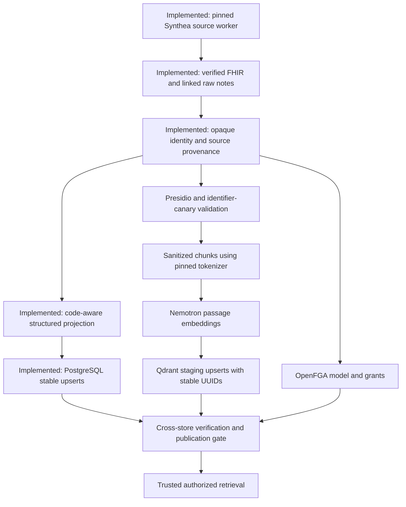

# Reproducible synthetic ingestion worker

Returning after a session reset? Read [NEXT-STEPS.md](NEXT-STEPS.md) for the completed work, local data locations, and ordered path to authorized vector search.

The source stage generates and verifies restricted Synthea source batches. The separate structured adapter below implements the projection policy approved on 2026-09-18. It produces FHIR R4 bundles plus linked raw clinical notes. **The source command does not de-identify, populate stores, embed, seed grants or publish a batch.** Those remaining stages are ordered below.

## Run the implemented source stage

Requirements: Linux, Python 3.12+, Docker access, network access to download the pinned release and runtime on first use, and approximately 4 GB RAM per generator. Python uses the standard library; Java runs in a pinned container with no network or store access. Run from the repository root:

```bash
# Ten synthetic patients. First run downloads the verified Synthea JAR/runtime.
python3 backend/ingestion/worker.py run --profile smoke

# Repeating this command verifies and reuses the existing completed batch.
python3 backend/ingestion/worker.py run --profile smoke

# One hundred synthetic patients; a separate batch identity.
python3 backend/ingestion/worker.py run --profile seed

# Copy the batch path printed by run into this command.
python3 backend/ingestion/worker.py verify .data/ingestion/<batch-id>

# Generate independently to test repeatability, rather than exercising reuse.
python3 backend/ingestion/worker.py run --profile smoke --output .data/ingestion-repeat
python3 backend/ingestion/worker.py compare .data/ingestion/<batch-id> .data/ingestion-repeat/<batch-id>

# Automated worker tests use a fake external Docker process, not real services.
python3 -m unittest discover -s backend/ingestion/tests -p 'test_*.py' -v
```

The CLI outputs a JSON summary with the batch path, ID, counts, and `source_ready` status. It never prints note text. The 10/100 counts are user-approved; the checked-in Massachusetts, English upstream notes, seeds 360/361, reference/end date 2026-09-01, and ten-year export window are reproducible **demo defaults**, not a claim that all clinical scope decisions are approved. Supply a copied config with `--config` to change them. Preserve the checked-in config as the validation baseline.

Synthea exports English encounter notes (History and Physical / Evaluation and Plan); it does not supply arbitrary note types chosen by this adapter. The exporter retains a ten-year history relative to the simulation endpoint, with its own handling of active/historical facts. This is not a promise that every resource date lies inside a strict calendar window. All FHIR resource types are kept in restricted source; The structured adapter projects Patient/Encounter/Condition/Observation separately from this restricted source.

## What repeats and what changes

[config/synthea.json](config/synthea.json) pins the official Synthea release JAR hash, source commit, Java image digest, CPU platform, both seeds, reference and end dates, geography, history window, and population profiles. The worker fixes UTC/English JVM settings, one generation thread, no overflow population, unsplit collection bundles, UUID filenames, and disables nondeterministic metadata output. Notes are extracted once from `DocumentReference`; duplicate `DiagnosticReport` representations are excluded. Older notes marked `superseded` remain in the historical corpus.

The batch ID hashes the complete config, selected profile, contract version, and worker source digest. Changing any of these creates a new batch. A completed batch is immutable: a rerun verifies every artifact hash, count, and note linkage before reuse. A corrupt batch is rejected rather than silently overwritten. Two independent runs can be compared for exact manifest, FHIR, and extracted-note equality. Generator console logs are diagnostic artifacts outside the equality contract; they can contain variable timings.

Repeatable source data does not guarantee bitwise-identical GPU embeddings across hardware or serving revisions. The future vector stage must pin model/image/tokenizer/profile, cache accepted embeddings by sanitized content and model contract, and reuse stable point IDs so retries do not create duplicate rows or vectors.

## Artifacts, failure, and recovery

```text
.data/ingestion/<batch-id>/
  manifest.json                  # pins, actual counts, source hashes, raw/unpublished flags
  generator.log                  # restricted diagnostics; never include in public reports
  artifacts/
    source/fhir/<patient-id>.json # full raw synthetic source bundles
    raw-notes.jsonl               # raw text with source patient/document/encounter lineage
```

The user-approved synthetic snapshot is tracked in `.data`; credential-bearing PostgreSQL backups and transient files remain ignored. See [.data/README.md](../../.data/README.md) for sharing scope and restoring owner-only permissions after checkout. Attempt/batch directories are mode 0700 and CLI-created files are restricted by umask 0077. These source IDs are not the downstream opaque patient keys. Raw synthetic names and identifiers still require the de-identification path before indexing.

The worker acquires an exclusive output-root lock. Concurrent jobs using that root fail with `worker_already_running`; rerun after the active job exits. Generation uses a fresh hidden `.attempt-*` directory. Only a fully validated attempt is renamed to the final batch directory. On failure, the attempt retains a restricted `failure.json` and log for inspection. Retrying starts a fresh attempt; it cannot resume Synthea halfway through a population. Completed output is reused without generation. Process timeouts stop the named generator container. No database writes occur in this stage.

Validation checks the supported bundle structure, distinct patient count, unique entry identities, reference resolution, matching note/encounter/patient links, UTF-8/base64 decoding, and nonempty notes. This is **not a full FHIR validator or a clinical quality evaluation**. Unsupported or broken linkage fails the entire source batch; it never produces a partially ready cohort.

## Steps to finish the planned pipeline



| Step | Implementation and completion evidence |
| --- | --- |
| **Pin and verify source — implemented** | Generate 10/100 patients, extract linked notes, retain actual counts/hashes, and prove fresh-run equality plus rerun reuse. See [source contract](research/synthea-generator-contract.md). |
| **Normalize patient identity and FHIR provenance — implemented** | Persistent restricted registry supplies stable patient/resource keys and citations across smoke, seed, restart and reprocessing. Exact reference and ownership checks reject bad links. Downstream note/grant/vector adapters must reuse these identities. |
| **Project structured FHIR into PostgreSQL — implemented** | Approved Patient/Encounter/Condition/Observation projection rebuilds nested JSON, applies reviewed labels and stable upserts, and rejects removals. See [committed validation evidence](structured-validation.md); raw notes remain separate. |
| **De-identify and validate clinical notes — implemented** | `notes.py` + `patient360/deid.py` (`p360-deid-1.0`). First cohort: authored p_101/p_103 notes. Canary failures quarantine. Eval corpus stays in `note_chunks_eval`. |
| **Seed grants and define chunk access — implemented** | Demo tuples remain `openfga-init`. `seed_grants.py` rewrites demo-relative windows and optionally maps `u_chen` attending onto the three Synthea demo keys. No bulk grants on the leftover 97. Retrieval is PDP then a server-built Qdrant filter. |
| **Chunk, embed, and index sanitized notes** | Inspect the running `nvidia/llama-nemotron-embed-vl-1b-v2` model ID, immutable image/profile, tokenizer, and actual input limit. Chunk with that tokenizer, preserve offsets, and use passage mode with truncation disabled. Verify response indices, finite values, and 2048-dimensional output; verify Qdrant `note_chunks` uses 2048/Cosine before writing. Use stable UUID point IDs, sanitized text, lineage, ACL fields, and publication state; create payload indexes. Use query mode later for retrieval. |
| **Orchestrate resumable batches and safe publication — implemented** | `notes.py` checkpoints per note id (`.data/notes-checkpoint.json`). Qdrant points are written `published=false` first; the row becomes queryable only after `sanitized_ref` + `deid_version` and a complete point set, then both stores flip `published=true`. Interrupted notes stay unpublished. Retries reuse UUID5 point ids. Eval corpus (`--eval-jsonl`) writes `note_chunks_eval` only. |

```bash
# First cohort (authored p_101 / p_103). --prepare-only never talks to stores.
python3 backend/ingestion/notes.py --prepare-only

# Remaining Synthea notes after grants are stable. Mapping is source patient id -> opaque key.
# Do not grant care relations on the leftover ~97; researcher stays aggregate-only.
python3 backend/ingestion/notes.py \
  --raw-notes .data/ingestion/<seed-batch-id>/artifacts/raw-notes.jsonl \
  --mapping .data/identity/patient-key-map.json \
  --checkpoint .data/notes-checkpoint.json \
  --qdrant-url http://127.0.0.1:6333

# Isolated evaluation corpus (never clinical-published).
python3 backend/ingestion/notes.py \
  --eval-jsonl .data/evaluation/<corpus-id>/raw-variants.jsonl \
  --prepare-only

# Time-relative demo windows + u_chen attending on the three Synthea demo keys. No bulk 97.
python3 backend/ingestion/seed_grants.py --dry-run \
  --synthea-demo-key p_syn_a --synthea-demo-key p_syn_b --synthea-demo-key p_syn_c
```
| **Validate the seed and document operations** | Run the source fixture through all stages, inspect expected/actual counts, clinical fidelity, identifier leakage, citation lineage, retrieval quality, allow/deny/revocation, replay, grant restart, and outage recovery. Only this evidence establishes a complete ingestion pipeline. |

The current Compose `ingest` profile starts imaging models; it is not this worker. The future source, sanitation, embedding, and store adapters belong under `backend/ingestion/`, while new container/service wiring belongs under `backend/deploy/`. Keep the worker outside the clinical agent's tool surface.

## Runtime observations from this implementation session

On 2026-09-17, Qdrant `/readyz` returned HTTP 200. The configured embedding endpoint `http://127.0.0.1:8001/v1/models` was unreachable. This establishes neither collection compatibility nor embedding readiness; those must be measured before implementing and exercising vector writes. No existing service was redeployed, and no records were written to the existing stores.

## Structured preparation and PostgreSQL

The structured adapter implements the [approved projection contract](../../.scratch/ingestion-pipeline/issues/05-fhir-projection.md#answer). The user approved all three policies on 2026-09-18. [Validation evidence](structured-validation.md) records the committed smoke/seed sequence and replay checks. This stage needs Python's standard library, Docker and the maintained PostgreSQL container; it uses `p360_worker` with its existing password inside the container. No administrator credentials or new dependencies are needed.

```bash
# Once, on an EMPTY clinical database only. Already done on this server.
python3 backend/ingestion/structured.py init-registry

# Prepare separately from immutable source; verify source integrity each time.
python3 backend/ingestion/structured.py prepare .data/ingestion/<batch-id>

# Validate a real PostgreSQL transaction without committing clinical/audit rows.
python3 backend/ingestion/structured.py load .data/ingestion/<smoke-batch-id> --dry-run

# On a fresh approved deployment: commit smoke, repeat (all changed counts must be zero),
# then commit seed and repeat. Each command revalidates and prepares its source.
python3 backend/ingestion/structured.py load .data/ingestion/<smoke-batch-id>
python3 backend/ingestion/structured.py load .data/ingestion/<smoke-batch-id>
python3 backend/ingestion/structured.py load .data/ingestion/<seed-batch-id>
python3 backend/ingestion/structured.py load .data/ingestion/<seed-batch-id>

# Keep a backup after extending the registry; destination must not exist.
python3 backend/ingestion/structured.py backup-registry --backup .data/identity/registry-backup.sqlite

# Tests against real worker permissions and rollback semantics.
RUN_STRUCTURED_POSTGRES_TESTS=1 python3 -m unittest discover -s backend/ingestion/tests -p 'test_*.py' -v
```

Use the real smoke and seed paths from [NEXT-STEPS.md](NEXT-STEPS.md). Shared defaults are `.data/identity/registry.sqlite` and `.data/prepared/`; `--registry`, `--output` and `--container` override locations for isolated checks. The registry and parent directory must be owner-restricted. Never initialize a replacement registry to recover an existing cohort: restore a consistent backup and preserve its opaque identities. Source regeneration alone cannot recreate random opaque keys.

An import stages all rows, rejects changed ownership/citations and source removals for included patients, upserts, checks every projected field, and writes its audit event in one transaction. Identical rows do not update timestamps. Retries reconcile the same identities; they never reset volumes. A crash after database commit but before the local receipt is safe to retry. Patients absent from the supplied batch are untouched. Removed resources/components require a future deletion policy; the worker has no clinical DELETE privilege.

Prepared artifacts contain temporary internal non-patient source upsert IDs and remain restricted. They are not application responses or embedding payloads. Full raw notes remain outside this stage. Structured stores have no implemented cross-store publication/read gate yet; a successful import is not authorized retrieval or note sanitization.

## Isolated adversarial evaluation fixtures

The [approved evaluation contract](../../.scratch/ingestion-pipeline/issues/06-note-generation-contract.md#answer) specifies eight deterministic attack variants and three unchanged source controls. [evaluation.py](evaluation.py) verifies the source batch and approved source selection, reads existing registry mappings without changing them, and writes only restricted local evaluation artifacts. It neither sanitizes nor invokes a model, sends messages, or writes to PostgreSQL/Qdrant.

```bash
python3 backend/ingestion/evaluation.py \
  .data/ingestion/71289501d068daa74e87a40619e942617c02663b8f675e5231631f50adea9f36 \
  --selection .data/clinical-demo/71289501d068daa74e87a40619e942617c02663b8f675e5231631f50adea9f36/candidate-evidence.json

# Run the same command again to verify/reuse its immutable artifacts.
# Add --output .data/evaluation-independent to compare an independent build.
python3 -m unittest discover -s backend/ingestion/tests -p test_evaluation.py -v
```

The default output is `.data/evaluation/<corpus-id>/`. Its manifest records source/selection/recipe digests and counts; artifacts include `raw-controls.jsonl`, `raw-variants.jsonl`, `cases.json` and `restricted-provenance.json`. The corpus identity depends on the registry and source/recipe contract; individual document identities are distinct from clinical documents. A changed builder creates a new versioned corpus directory. Existing corrupted artifacts are rejected, never overwritten.

The approved synthetic selection and identity registry are included in the user-requested `.data` snapshot. Restore owner-only permissions after checkout and use them together with their verified source on another machine. A fresh source generation alone does not recreate the random opaque identities or the approved source-selection evidence. Missing mappings or mismatched hashes/links fail the build.

Artifacts remain **unsanitized and unpublished**. Expected outcomes in `cases.json` are test specifications, each marked `not_run`; no model-security result is implied. Ordinary source/structured commands reject the evaluation manifest as a clinical source batch. Future evaluation ingestion must use dedicated test storage and the same sanitization/authorization policy; downstream isolation is not implemented by this builder. Source narrative is preserved exactly, and attack passages must not be executed by any operator or tool.
