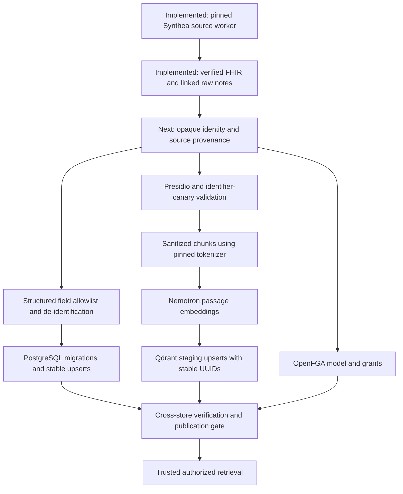

# Reproducible synthetic ingestion worker

Returning after a session reset? Read [NEXT-STEPS.md](NEXT-STEPS.md) for the completed work, local data locations, and ordered path to authorized vector search.

The first implemented stage generates and verifies restricted Synthea source batches. It produces FHIR R4 bundles plus linked raw clinical notes. **It does not yet de-identify, embed, populate PostgreSQL/Qdrant, seed grants, or publish a batch.** Those remaining stages are ordered below.

## Run the implemented source stage

Requirements: Linux, Python 3.12+, Docker access, network access to download the pinned release and runtime on first use, and approximately 4 GB RAM per generator. Python uses the standard library; Java runs in a pinned container with no network or store access. Run from the repository root:

```bash
# Ten synthetic patients. First run downloads the verified Synthea JAR/runtime.
python3 backend/ingestion/worker.py run --profile smoke

# Repeating this command verifies and reuses the existing completed batch.
python3 backend/ingestion/worker.py run --profile smoke

# One hundred synthetic patients; a separate batch identity.
python3 backend/ingestion/worker.py run --profile seed

# Copy the batch path printed by run into this command.
python3 backend/ingestion/worker.py verify .data/ingestion/<batch-id>

# Generate independently to test repeatability, rather than exercising reuse.
python3 backend/ingestion/worker.py run --profile smoke --output .data/ingestion-repeat
python3 backend/ingestion/worker.py compare .data/ingestion/<batch-id> .data/ingestion-repeat/<batch-id>

# Automated worker tests use a fake external Docker process, not real services.
python3 -m unittest discover -s backend/ingestion/tests -p 'test_*.py' -v
```

The CLI outputs a JSON summary with the batch path, ID, counts, and `source_ready` status. It never prints note text. The 10/100 counts are user-approved; the checked-in Massachusetts, English upstream notes, seeds 360/361, reference/end date 2026-09-01, and ten-year export window are reproducible **demo defaults**, not a claim that all clinical scope decisions are approved. Supply a copied config with `--config` to change them. Preserve the checked-in config as the validation baseline.

Synthea exports English encounter notes (History and Physical / Evaluation and Plan); it does not supply arbitrary note types chosen by this adapter. The exporter retains a ten-year history relative to the simulation endpoint, with its own handling of active/historical facts. This is not a promise that every resource date lies inside a strict calendar window. All FHIR resource types are kept in restricted source; Patient/Condition/Observation is the proposed later structured projection.

## What repeats and what changes

[config/synthea.json](config/synthea.json) pins the official Synthea release JAR hash, source commit, Java image digest, CPU platform, both seeds, reference and end dates, geography, history window, and population profiles. The worker fixes UTC/English JVM settings, one generation thread, no overflow population, unsplit collection bundles, UUID filenames, and disables nondeterministic metadata output. Notes are extracted once from `DocumentReference`; duplicate `DiagnosticReport` representations are excluded. Older notes marked `superseded` remain in the historical corpus.

The batch ID hashes the complete config, selected profile, contract version, and worker source digest. Changing any of these creates a new batch. A completed batch is immutable: a rerun verifies every artifact hash, count, and note linkage before reuse. A corrupt batch is rejected rather than silently overwritten. Two independent runs can be compared for exact manifest, FHIR, and extracted-note equality. Generator console logs are diagnostic artifacts outside the equality contract; they can contain variable timings.

Repeatable source data does not guarantee bitwise-identical GPU embeddings across hardware or serving revisions. The future vector stage must pin model/image/tokenizer/profile, cache accepted embeddings by sanitized content and model contract, and reuse stable point IDs so retries do not create duplicate rows or vectors.

## Artifacts, failure, and recovery

```text
.data/ingestion/<batch-id>/
  manifest.json                  # pins, actual counts, source hashes, raw/unpublished flags
  generator.log                  # restricted diagnostics; never include in public reports
  artifacts/
    source/fhir/<patient-id>.json # full raw synthetic source bundles
    raw-notes.jsonl               # raw text with source patient/document/encounter lineage
```

Artifacts live in ignored storage. Attempt/batch directories are mode 0700 and CLI-created files are restricted by umask 0077. These source IDs are not the downstream opaque patient keys. Raw synthetic names and identifiers still require the de-identification path before indexing.

The worker acquires an exclusive output-root lock. Concurrent jobs using that root fail with `worker_already_running`; rerun after the active job exits. Generation uses a fresh hidden `.attempt-*` directory. Only a fully validated attempt is renamed to the final batch directory. On failure, the attempt retains a restricted `failure.json` and log for inspection. Retrying starts a fresh attempt; it cannot resume Synthea halfway through a population. Completed output is reused without generation. Process timeouts stop the named generator container. No database writes occur in this stage.

Validation checks the supported bundle structure, distinct patient count, unique entry identities, reference resolution, matching note/encounter/patient links, UTF-8/base64 decoding, and nonempty notes. This is **not a full FHIR validator or a clinical quality evaluation**. Unsupported or broken linkage fails the entire source batch; it never produces a partially ready cohort.

## Steps to finish the planned pipeline



| Step | Implementation and completion evidence |
| --- | --- |
| **Pin and verify source — implemented** | Generate 10/100 patients, extract linked notes, retain actual counts/hashes, and prove fresh-run equality plus rerun reuse. See [source contract](research/synthea-generator-contract.md). |
| **Normalize patient identity and FHIR provenance — next** | Choose the synthetic identity namespace/linkage policy. Map each source patient to one stable opaque key shared by rows, notes, grants, and chunks. Preserve source references in restricted provenance; reject ambiguous/dangling references. Test repeat identity, distinct patients, and cross-patient mismatches. |
| **Flatten de-identified FHIR into PostgreSQL** | Agree an explicit safe projection of Patient/Condition/Observation, including codes, values, units, dates, and components. Migrate existing volumes to add stable source-resource uniqueness. Never insert full raw bundles into unrestricted `resource` JSONB. Test correct clinical values and repeated-run upserts. |
| **De-identify and validate clinical notes** | Reuse the source-linked Synthea notes, then pin Presidio, NLP/recognizer versions, replacement/date policy, and language. Validate planted identifier canaries and clinical utility. Quarantine failed or uncertain output before any embedding request. Preserve synthetic/generated lineage. |
| **Seed grants and define chunk access** | Resolve the care-team/consent policy, install the OpenFGA model, retain store/model IDs, and seed grants idempotently. Decide durable storage or fail-closed reseeding. Define the trusted retrieval filter and required patient/security metadata. Test allowed, denied, missing-metadata, and revoked access. |
| **Chunk, embed, and index sanitized notes** | Inspect the running `nvidia/llama-nemotron-embed-vl-1b-v2` model ID, immutable image/profile, tokenizer, and actual input limit. Chunk with that tokenizer, preserve offsets, and use passage mode with truncation disabled. Verify response indices, finite values, and 2048-dimensional output; verify Qdrant `note_chunks` uses 2048/Cosine before writing. Use stable UUID point IDs, sanitized text, lineage, ACL fields, and publication state; create payload indexes. Use query mode later for retrieval. |
| **Orchestrate resumable batches and safe publication** | Extend the same batch interface with per-stage manifests/checkpoints. Persist only validated outputs; reuse embeddings on retry. Verify PostgreSQL, Qdrant, and grants before a trusted read gate marks a batch queryable. Define replacement/deletion semantics and test interruptions after each store write. Flags in Qdrant alone do not enforce this gate. |
| **Validate the seed and document operations** | Run the source fixture through all stages, inspect expected/actual counts, clinical fidelity, identifier leakage, citation lineage, retrieval quality, allow/deny/revocation, replay, grant restart, and outage recovery. Only this evidence establishes a complete ingestion pipeline. |

The current Compose `ingest` profile starts imaging models; it is not this worker. The future source, sanitation, embedding, and store adapters belong under `backend/ingestion/`, while new container/service wiring belongs under `backend/deploy/`. Keep the worker outside the clinical agent's tool surface.

## Runtime observations from this implementation session

On 2026-09-17, Qdrant `/readyz` returned HTTP 200. The configured embedding endpoint `http://127.0.0.1:8001/v1/models` was unreachable. This establishes neither collection compatibility nor embedding readiness; those must be measured before implementing and exercising vector writes. No existing service was redeployed, and no records were written to the existing stores.
