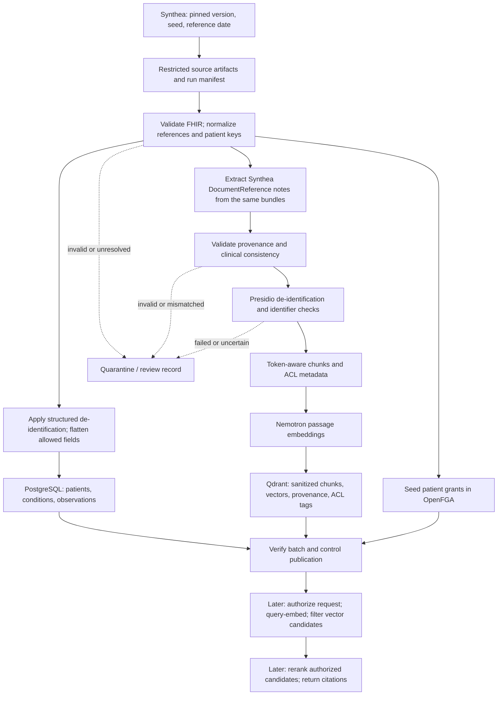

# Patient360 synthetic ingestion: proposed sequence

This is the reading guide for [Plan the Patient360 synthetic ingestion pipeline](../../.scratch/ingestion-pipeline/map.md), the canonical local wayfinder map. It charts implementation order; it does not resolve the open decisions. Each linked issue holds its eventual answer. Branch: `ingestion-pipeline`. On 2026-09-17 the user authorized implementation using Synthea. The [source worker](worker.py) now generates and verifies restricted raw batches; no ingestion records have been written to stores. See the [runbook](RUNBOOK.md) for commands, evidence, and remaining stages.

The [ordered GitHub implementation backlog](issues.md) tracks execution, with the `ingestion` label on every issue. The local wayfinder tickets below retain the design questions that each implementation step must resolve.

## Destination and first slice

Prepare a reproducible seed of synthetic patients and linked clinical notes in Patient360's existing PostgreSQL and Qdrant stores, with consistent opaque patient keys, traceable transformations, and access checks. Approved size: 10 patients for smoke checks, then 100 for the first seed (2026-09-17; [partial scope decision](../../.scratch/ingestion-pipeline/issues/03-cohort-and-success.md)). The proposed starting scope is a batch job and Patient/Condition/Observation; remaining cohort choices are open. The user supplied Synthea; its FHIR export already includes linked template-generated clinical notes. The [inspected contract](research/synthea-generator-contract.md) replaces the earlier unknown note-generator prerequisite.

Treat the user-supplied `/home/nvidia/Documents/patient360-architecture copy.html` as the architecture reference. Its ingestion and quarantine details are newer than the repository's `architecture.html`. Here, “vector database” means Patient360 Qdrant; the separate hybrid RAG overlay selects Elasticsearch and disables Milvus.

## Proposed data flow

A publication gate is a required design choice, not an existing service. The worker must stay outside the clinical agent's tool surface. Attach/validate access metadata before publishing chunks; the exact ordering around the embedding call can be chosen once the payload contract is settled. Do not send ACL metadata as clinical text to the embedding model.

## Step-by-step route

| Step | Intended implementation result, after decisions close | Decision tickets |
| --- | --- | --- |
| 1. Pin the synthetic inputs | Fixed Synthea version/configuration/seed/date, explicit FHIR R4 output, actual-count manifest, and a known note-generator contract | [Identify the synthetic-note generator and obtain its API contract](../../.scratch/ingestion-pipeline/issues/01-note-generator-input.md); [Verify Synthea, Presidio, and embedding integration contracts](../../.scratch/ingestion-pipeline/issues/02-source-and-model-contracts.md); [Choose the first cohort and ingestion success criteria](../../.scratch/ingestion-pipeline/issues/03-cohort-and-success.md) |
| 2. Establish common identity | Resolve FHIR references; assign one opaque patient key across both stores and grants; preserve source lineage separately | [Define patient identity, linkage, and source provenance](../../.scratch/ingestion-pipeline/issues/04-identity-and-provenance.md) |
| 3. Load structured records | De-identify/project allowed FHIR fields and upsert Patient/Condition/Observation without duplicates | [Choose the FHIR-to-PostgreSQL projection and update rules](../../.scratch/ingestion-pipeline/issues/05-fhir-projection.md) |
| 4. Prepare matching notes | Source worker extracts Synthea notes from DocumentReference once, retaining patient/encounter/source references; downstream clinical acceptance and sanitized processing remain | [Define clinically linked synthetic-note generation](../../.scratch/ingestion-pipeline/issues/06-note-generation-contract.md) |
| 5. Sanitize and chunk notes | Validate Presidio output; reject/quarantine failures; split sanitized text within the actual embedding token budget | [Choose note de-identification and chunk boundaries](../../.scratch/ingestion-pipeline/issues/07-deid-and-chunking.md) |
| 6. Seed access and stamp metadata | Load the authorization model and grants; attach required patient/security metadata to every chunk | [Define grants, chunk ACL metadata, and retrieval enforcement](../../.scratch/ingestion-pipeline/issues/08-grants-and-acl.md) |
| 7. Embed and write Qdrant | Use the pinned passage-embedding contract; verify dimension/distance; upsert stable chunk IDs with safe payloads | [Choose the embedding and Qdrant note-chunk contract](../../.scratch/ingestion-pipeline/issues/09-vector-contract.md) |
| 8. Publish and recover safely | Check cross-store completion, control visibility, record sanitized run evidence, and resume/replay failures | [Choose batch orchestration, publication, and recovery](../../.scratch/ingestion-pipeline/issues/10-batch-lifecycle.md) |
| 9. Prove the seed | Demonstrate counts, linkage, clinical fidelity, identifier checks, allow/deny/revocation, idempotency, and recovery | [Define acceptance evidence and the implementation handoff](../../.scratch/ingestion-pipeline/issues/11-acceptance-and-handoff.md) |
| Later. Retrieve and rerank | Authorize and filter candidates before text reaches the reranker; evaluate ranking improvements separately | Handoff contract in the access and vector tickets; reranker implementation is outside this map |

Steps 3 and 4 can proceed in parallel after their decisions settle. Grant design can proceed alongside note processing. Dependencies in the issues, rather than table order alone, determine what is takeable next.

## Current checkout: evidence and implications

These are configuration observations, not live readiness results.

| Existing artifact | Observation relevant to the plan |
| --- | --- |
| [Patient360 Compose](../deploy/patient360/compose.yaml) | PostgreSQL 16, Qdrant 1.13.6, OpenFGA, OpenBao, MinIO, and local Nemotron embedding are defined. immudb is retained under the `legacy` profile; the new default audit schema is PostgreSQL. No source worker, Presidio, retrieval policy service, or Patient360 reranker is defined as a Compose service. The `ingest` profile selects imaging models. |
| [FHIR initialization SQL](../deploy/patient360/sql/fhir/01-init.sql) | Main adds `clinical`, `identity`, and `audit` schemas, top-level JSONB allowlists, source uniqueness, component observations, and patient-scoped foreign keys. Birth-date precision and raw source-ID storage differ from the ingestion decisions; see [schema integration](schema-integration.md). Existing volumes still need a migration plan. |
| [Qdrant initialization](../deploy/patient360/stores/init/qdrant.sh) | Creates `note_chunks` with 2048 dimensions and Cosine. Does not establish payload indexes, ACL enforcement, or compatible model output. |
| [OpenFGA model](../deploy/patient360/stores/openfga/model.fga) and [initialization](../deploy/patient360/stores/init/openfga.sh) | `viewer = care_team or consented`; initializer only attempts store creation. Model installation and tuple seeding are absent; configured memory storage loses state on restart. |
| Patient360 MinIO and OpenBao configuration | MinIO creates reports and VLM-description buckets, not quarantine. OpenBao is dev mode on a separate network; durable identity linkage is not implemented. |
| [Hybrid RAG Compose](../deploy/compose.hybrid.yaml) | Separate Elasticsearch document pipeline (Milvus disabled). Its ranking configuration does not provide a Patient360 reranker or policy boundary. |

## Boundaries to retain while deciding

- Synthetic source data still exercises the same de-identification path. Presidio alone does not establish complete anonymization; retained patient linkage is pseudonymous identity.
- Flattening FHIR is a structural transformation. Field-level privacy rules also apply to nested JSON, narratives, extensions, references, dates, and logs.
- Chunk ACL tags describe access context. Enforcement belongs to trusted retrieval code and current grants; deny by default for unknown principals, missing metadata, or failed policy checks.
- Never let vector search expose unauthorized text to a reranker and then filter afterward. Revoked grants must take effect without depending solely on re-embedding or stale embedded user lists.
- Generated notes must retain their synthetic/generated provenance. Do not overwrite structured facts with unsupported generated claims.
- No global transaction spans PostgreSQL, Qdrant, and OpenFGA. Decide replay, partial-failure handling, visibility, and deletion before claiming a batch is ready.

## Research available

[Source and model contract findings](research/source-model-contracts.md) record primary-source evidence. In particular, distinguish the VL model’s 2048-dimensional output from its documented default serving-profile token limit; inspect the actual deployed profile before choosing chunk sizes. This closes the documentation investigation, not the open design choices or runtime checks.

## How to continue

Inspect the map's child metadata to find open, unassigned issues whose blockers are resolved. The generator, cohort, and identity/provenance decisions are resolved. Safe FHIR projection and update rules are next in frontier order; note-generation and grant decisions are also unblocked. The identity adapter and restricted registry still need implementation under their resolved contract. Claim one decision before working it, resolve through the appropriate human exchange, append its answer, and update the map's decision index. [Handoff acceptance scenarios and executable worker tests](tests/README.md) document verification; the [runbook](RUNBOOK.md) lists the remaining implementation stages.
