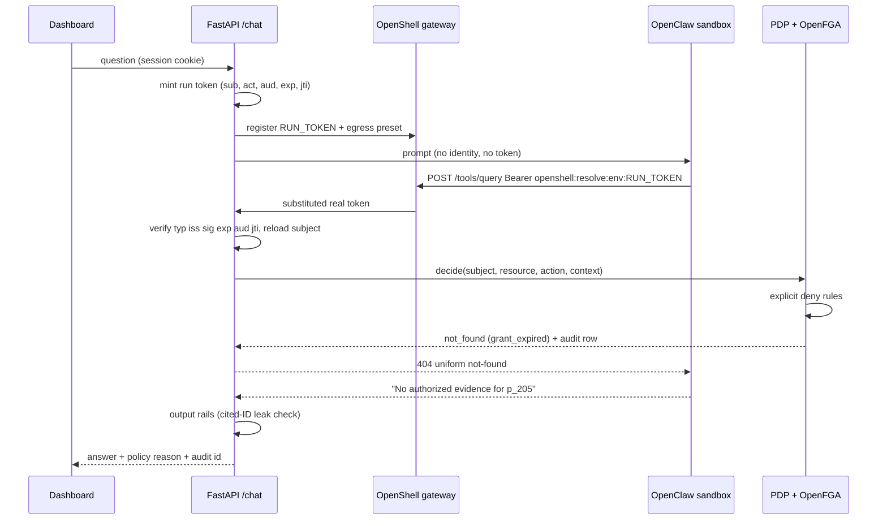

# Patient360 Secure Clinical Agent — Build Plan

**Event:** HPE & NVIDIA Agentic AI Hackathon, Swiss AI Weeks, September 2026. Challenge: Patient360 Secure Clinical Agent (difficulty: extreme).
**Team window:** 4–7 days, 3–4 people.
**Goal:** win on evidence, not features. Every access decision is visible, testable, and attributable.

---

## 1. Brief and positioning

### 1.1 The challenge

Build a sandboxed clinical assistant that aggregates and queries anonymized patient records across multiple sources, gives grounded answers, and enforces explicit privacy and access policies. Authorization, tool boundaries, prompt injection, data leakage, and guardrails must be part of the design. Suggested tools: NemoClaw, NeMo Guardrails, NVIDIA NIM. Suggested data: Synthea FHIR or a PMC dataset. There is no published rubric.

### 1.2 What "state of the art" looks like today, and where the gap is

| Family | Representative systems | What they have | What they lack |
|---|---|---|---|
| FHIR capability agents | EHRAgent (EMNLP 2024), MedAgentBench / v2 (NEJM AI 2025, 69.7% → 98%), FHIR-AgentBench (50% → 77% with RL), FHIR-Hopper (ICML 2026), PhysicianBench (46% pass@1) | Structured tools beat raw FHIR HTTP; flattened SQL or graph traversal beats dumping FHIR JSON into context | Every benchmark states "no security implementation"; agents talk to FHIR directly; memory and code execution are leakage paths |
| NVIDIA sandbox demos | Local Healthcare Agent on DGX Station (NemoClaw + OpenShell + Nemotron 3 Super, May 2026); Foxconn CoDoClaw | `inference.local` routing, implicit-deny egress, editable skills, Synthea data | Six *specialist* agents, not six *personas*; Python executes over FHIR inside the sandbox; no grants, consent, redaction, k-min, or attack scoreboard |
| FHIR policy servers | Fire Arrow (token forwarding, LegitimateInterest, PatientCompartment, dual audit); Google Cloud Healthcare Consent; XACML/CBAC | "The LLM is not the security boundary"; consent as a resource; deny-overrides; obligations | Not a clinical assistant; no persona demo; no injection evaluation |
| Aggregate privacy | Query, Don't Train (k ≥ 2 SQL agent), TempoQL (schema-only LLM), LATCH, k-anonymity decay (79.9% of patients below k=5 after ~7 turns), cube-count reconstruction | Minimum cell size, overlap blocking, schema-only prompting | k=2 is weak; suppression on full cubes is invertible |
| Clinical safety / injection | MPIB (9,697 cases; ASR vs Clinical Harm Event Rate), RAGPROBE, hidden-text note injection (Meditron 8.7% ASR vs Gemma-3 96%), medical-advice injection (94.4% success) | Indirect injection through retrieved notes is worse than direct; ASR reductions do not imply harm reductions | Evaluation only; no defended system |
| Commercial | Dragon Copilot / DAX, Abridge, Ambience (scribes); OpenEvidence (cited literature); Glass Health (differentials); Google AMIE (Nature, Jun 2026); Microsoft Healthcare Agent Orchestrator | Production polish, one-EHR write-back | A different job: none query a multi-source record under per-user policy |

**Nobody ships the combination**: an ABAC policy decision point on every tool call, the same question answered six different ways for six identities, indirect-injection defence with an honest scoreboard, field-level obligations, and uniform not-found. That combination is the deliverable.

### 1.3 Steal, do not reinvent

1. NVIDIA playbook: OpenClaw in OpenShell, `inference.local`, implicit-deny egress. Replace their public FHIR + Python execution with PDP-gated `/tools/*`.
2. Fire Arrow: token never in the model; audit both the agent and the on-behalf-of user; property filters as obligations.
3. MedAgentBench v2: three typed tools, not raw FHIR HTTP or a code interpreter.
4. FHIR-Hopper: structured first, retrieve details on demand; do not RAG the whole chart.
5. QDT and the k-decay paper: k-min, overlap blocking, session-level residual.
6. MPIB: report attack success *and* harm, show partials.

---

## 2. Decisions locked

| Area | Decision | Why |
|---|---|---|
| Architecture | Agent + tools, not RAG. Structured SQL path, small ACL-filtered notes path, imaging *report* path. One PDP on every read. | FHIR is structured; vector RAG cannot answer aggregates and has no authorization layer |
| Grant store | **OpenFGA** (Postgres datastore), extended model with time-window conditions and `but not blocked`. **The only grant store.** | Relationship checks with expiry, revocation, and explicit deny as data, not code paths |
| Consent record | No `consents` table. Provenance (granted_by, scope, justification, revoked_at) is `consent_granted` / `consent_revoked` / `break_glass` rows in append-only `audit_events`, written in the same handler as the tuple | One enforced store, one immutable log |
| Self-access | Identity, not a grant. No `self` tuple, no `self_patient_id` column. Vault `resolve_self` at login → server-side session only. PDP compares in memory | The login → pseudonym link persists in exactly one place: the vault |
| User ids | Opaque everywhere (`u_7f3a`). Names exist only in the dev-login map and the vault | Grant tuples link two pseudonyms |
| Pseudonyms | Random `p_xxx`, mapping in the vault. Not HMAC of MRN | HIPAA §164.514(c): re-identification code must not be derived from the individual |
| Sensitivity | HL7 HCS security labels: `confidentiality ∈ {N,R,V}` + `sensitivity[]` (`PSY`, `HIV`, `ETH`, `STD`, `SEX`, `GDIS`…), obligations as HL7 codes (`REDACT`) | Replaces home-made T0–T3 with the FHIR-native vocabulary. Resource-by-resource contract in [Patient360-FHIR-Resource-Plan.md](Patient360-FHIR-Resource-Plan.md) |
| Audit | `audit.audit_events` in the same Postgres as the clinical data, own schema and roles, SHA-256 hash chain, shaped like FHIR `AuditEvent` with `purpose_of_event ∈ {TREAT, HRESCH, BTG, PATRQT, HOPERAT}`. immudb retired | Exportable, auditor-readable, break-glass is a purpose of use; one database keeps fail-closed trivial and the append-only guarantee comes from roles, not a second server |
| Sessions | NIST SP 800-63-4 / ASVS 5.0 V7: `auth_level` is an AAL; CSPRNG 128-bit id; rotate on login and step-up; 1 h inactivity for care roles | Step-up for `V` labels and off-duty access |
| Run token | RFC 9068 JWT profile + RFC 8693 `act` claim. `typ=at+JWT`, `iss`, `sub`, `act.sub`, `aud`, `exp` 10 min, `iat`, `jti`; bound to session | Delegation is visible *and* limited |
| Aggregates | `k_min` configurable, default 5, CMS-grade 11 toggle; complementary suppression; restricted dimensions; overlap log | HIPAA sets no universal k; CMS forbids any derivable 1–10 cell |
| Demo data | Six personas and p_101/p_102/p_103/p_205 hand-seeded on day 1; Synthea 100 patients on day 3–4 | PDP and demo never wait on ingestion |
| LLM | Local `nano` NIM for development; Nemotron 3 Super via NVIDIA cloud for the demo; both behind `inference.local` | Super does not fit next to safety + embed on two H100s |
| Embedding / vectors | Keep the embed NIM already warm; dimension is an env var read by `qdrant.sh` and the embed client. Qdrant stays. No reranker, no knowledge graph | Corpus is tiny after ACL filtering; graphs cross patient boundaries |
| Imaging | Report-only tier for the hackathon via `/tools/imaging`; pixels and original documents only via `POST /media/sign` + image auth proxy (PDP resource types `imaging_pixels`, `document_bytes`, OpenFGA `can_view_pixels`). No sandbox route to Orthanc or MinIO. VISTA-3D / MedGemma are stretch | Text can be gated; pixels cannot be redacted |
| Agent runtime | `AGENT_RUNTIME=openshell|inproc`. Same tool client, same run token | Demo does not depend on OpenShell being cooperative |
| Frontend | Reuse the Vue app; replace `mockApi.ts` with a real client behind the same method names; `/me` manifest gates panels; add `/redteam` and `/threat-model` | Existing views already cover clinician, portal, cohort, audit |
| Break-glass | Human dashboard action only, typed justification, time-boxed `emergency` tuple, `BTG` audit row. No such tool exists | Emergency access is a governance track, not an agent capability |

---

## 3. Runtime architecture

```mermaid
flowchart LR
    subgraph client [Client]
        UI[Role-aware dashboard]
        OHIF[OHIF viewer]
        RT[Red-team harness]
    end
    subgraph backend [FastAPI backend]
        AUTH[auth + sessions]
        CHAT[/chat]
        PDP[PDP]
        TOOLS[/tools/query notes imaging]
        HUMAN[consent break-glass identity]
        RAILS[NeMo Guardrails]
        AUD[(audit_events)]
    end
    subgraph nemoclaw [NemoClaw on OpenShell]
        GW[OpenShell gateway]
        SBX[OpenClaw sandbox per session]
    end
    subgraph inference [Inference]
        NIM[nano NIM or cloud Super]
        SAFE[safety NIM]
        EMB[embed NIM]
    end
    subgraph stores [Stores]
        PG[(Postgres FHIR + identity)]
        FGA[(OpenFGA grants)]
        QD[(Qdrant note chunks)]
        ORT[(Orthanc)]
        MIN[(MinIO reports quarantine)]
        VAULT[(OpenBao linkage vault)]
    end
    subgraph ingest [Ingestion worker]
        SYN[Synthea flatten]
        NOTES[notes + Presidio + embed]
        SEED[seed grants]
    end
    UI --> AUTH
    UI --> CHAT
    UI --> HUMAN
    OHIF --> TOOLS
    RT --> CHAT
    CHAT --> GW
    GW --> SBX
    SBX -->|inference.local| GW
    GW --> NIM
    SBX -->|placeholder header| GW
    GW -->|real run token| TOOLS
    TOOLS --> PDP
    HUMAN --> PDP
    PDP --> FGA
    PDP --> AUD
    TOOLS --> PG
    TOOLS --> QD
    TOOLS --> MIN
    CHAT --> RAILS
    RAILS --> SAFE
    TOOLS --> EMB
    AUTH --> VAULT
    HUMAN --> VAULT
    SYN --> PG
    NOTES --> QD
    SEED --> FGA
    SYN --> VAULT
    NOTES --> MIN
```

### 3.1 Request path for a denied read



### 3.2 Identity flow: who knows what

| Store | Answers | Never contains |
|---|---|---|
| IdP / dev-login map | who is this person → `u_7f3a` | clinical data, pseudonyms |
| `users` | what role does `u_7f3a` have | name, login, self patient key |
| OpenFGA | which patients does `u_7f3a` relate to, until when | names, clinical data, self relation |
| Vault | which pseudonym *is* `u_7f3a`; real identity ↔ `p_xxx` | anything else |
| `sessions` | is `u_7f3a` logged in, on duty, stepped up; transient `self_patient_id` | persisted identity links |
| `audit_events` | what `u_7f3a` did, why, outcome | credentials |

Re-identifying anyone requires joining at least two stores across separate credentials. The agent, the tools, and the dashboard data paths never talk to the IdP or the vault.

---

## 4. Access control

### 4.1 Policy decision point

One function, called by every tool and human endpoint, producing one audit row per call.

```python
@dataclass
class Subject:      # resolved server-side from the run token or session, never from prompt or tool args
    user_id: str; role: str; department: str; credential_level: int
    on_duty: bool; auth_level: int; self_patient_id: str | None

@dataclass
class Resource:
    type: Literal["clinical_rows", "notes", "imaging_report", "imaging_pixels", "document_bytes", "aggregate"]
    patient_key: str | None; dataset: str | None
    confidentiality: str; sensitivity: list[str]

@dataclass
class Context:
    now: datetime; channel: Literal["agent", "dashboard"]; purpose: str
    jti: str | None; group_by: list[str] | None

@dataclass
class Decision:
    effect: Literal["permit", "deny", "not_found"]
    obligations: Obligations          # redact_fields, k_min, date_shift, allowed_dims
    reason_code: str                  # grant_expired, off_duty_step_up_required, ...
    policy_id: str
    audit_id: UUID
```

Evaluation order:

1. **Explicit deny.** `blocked` tuple; care role with `on_duty = false` → `off_duty_step_up_required`; `auth_level` below the label's requirement (`V` needs AAL2) → `step_up_required`; `patient` role on any key other than `session.self_patient_id` → hard deny; agent channel with any non-read action.
2. **Self match.** `patient` role and `patient_key == session.self_patient_id` → permit with patient obligations. OpenFGA is not consulted.
3. **Relationship.** One OpenFGA `check` (`user:u_xxx`, `can_read_notes`, `patient:p_xxx`) with `current_time` in the context. `false` → `not_found`, not `deny`.
4. **Obligations.** Role and label rules: `care_team` gets `REDACT` on `R`/`V` rows; `self` loses clinician-internal notes and keeps provenance; `caregiver` sees only datasets whose scope relation exists; `consultant` gets specialty datasets; `researcher` reaches only the aggregate branch with `k_min`, `date_shift`, `allowed_dims`.
5. **Default deny.**

Uniform not-found: unauthorized and nonexistent patients return byte-identical 404 bodies.

### 4.2 Grant store (OpenFGA)

```text
model
  schema 1.1

type user

type patient
  relations
    define attending: [user with active_window]
    define care_team: [user with active_window]
    define consultant: [user with active_window]
    define caregiver: [user with active_window]
    define caregiver_notes: [user with active_window]
    define emergency: [user with active_window]
    define blocked: [user]
    define can_read_clinical: (attending or consultant or care_team or caregiver or emergency) but not blocked
    define can_read_notes: (attending or consultant or care_team or caregiver_notes or emergency) but not blocked
    define can_read_imaging_report: (attending or consultant or emergency) but not blocked
    define can_view_pixels: (attending or consultant or emergency) but not blocked

type project
  relations
    define researcher: [user with active_window]

condition active_window(current_time: timestamp, start: timestamp, expiry: timestamp) {
  current_time >= start && current_time < expiry
}
```

Only three human actions write tuples, all through PDP-checked dashboard endpoints: consent grant (write tuple + `consent_granted`), consent revoke (delete tuple + `consent_revoked`), break-glass (write `emergency` tuple + `break_glass` with justification and compliance flag). The ingestion worker seeds the initial set. The agent has no path to any of them.

### 4.3 Run token

Purpose: the agent carries identity it cannot read or forge.

```json
{
  "typ": "at+JWT",
  "iss": "patient360-backend",
  "sub": "user:u_7f3a",
  "act": { "sub": "agent:sbx_01" },
  "aud": "patient360-tools",
  "iat": 1758066600,
  "exp": 1758067200,
  "jti": "a1b2c3",
  "sid": "sess_9d4e"
}
```

Lifecycle: `/chat` mints the token, registers it in the OpenShell credential store as `RUN_TOKEN`, and writes the egress preset alongside it (the known 403 gotcha). The agent sends `Authorization: Bearer openshell:resolve:env:RUN_TOKEN`; the gateway substitutes the real value at egress. Tool endpoints verify signature, `typ`, `iss`, `aud`, `exp`, and that the `sid` session is still live (present, unexpired, unrevoked), then reload role and grants for `sub`; `jti` is recorded on the audit row for correlation. Session end revokes every token minted from it because the `sid` check fails. A leaked transcript contains only the placeholder.

### 4.4 Sessions

Server-side `sessions` table. CSPRNG 128-bit id in a `Secure; HttpOnly; SameSite` cookie. Rotate on login and on step-up. `auth_level` is the NIST AAL of the login event (1 = password/dev-login, 2 = phishing-resistant second factor). Care roles: 1 h inactivity, 24 h absolute. Transient `self_patient_id` for patient/caregiver roles, filled by one vault call at login, gone at logout.

### 4.5 Linkage vault (OpenBao)

Holds real identity ↔ `p_xxx` and portal login ↔ `p_xxx`. Exactly four operations, each audited: `register`, `resolve_self`, `break_glass_identity`, `identity_banner`. Separate credentials and network. Agent, tools, prompts, and logs never see a name.

---

## 5. Tools (read-only, PDP on every call)

| Endpoint | Input | Output | Enforcement |
|---|---|---|---|
| `POST /tools/query` | `patient_key?`, `dataset ∈ {labs, meds, conditions, encounters}`, filters, `aggregate?: {group_by, measure}` | rows with `REDACT` applied, or aggregates | per-patient path requires relationship; aggregate path requires `researcher`, applies `k_min`, complementary suppression, `allowed_dims`, logs the query for overlap detection |
| `POST /tools/notes` | `patient_key`, `question` | chunks with `note_id` citations | Qdrant filter built server-side from the decision (`patient_key`, allowed `confidentiality`, `published=true`); no caller filter can widen it |
| `POST /tools/imaging` | `patient_key` | report text, modality, study id | never pixels; signed viewer URLs are issued only to the dashboard, not to the agent |

Identity comes only from the run token. Tool arguments never carry user identity; if they do, they are ignored and logged.

### 5.1 Bytes: DICOM pixels and original documents (dashboard only)

Pixels and original files cannot be redacted, so they never pass through the agent. They reach the browser through a second exit from the same PDP:

| Endpoint | Caller | Decision | Output |
|---|---|---|---|
| `POST /media/sign {study_id \| object_key}` | dashboard (session cookie) | PDP on resource type `imaging_pixels` or `document_bytes`; `can_view_pixels` for care roles, `self` for own studies; `care_team` gets metadata only; `researcher`, `caregiver`, `dietary_staff` get the uniform 404 | signed URL `{sub, sid, study_uid \| object_key, scope, exp 5 min, jti}`; audit row `media_sign` |
| `GET /media/{signed}/...` | OHIF viewer / document viewer | image auth proxy verifies signature, expiry, live session, `jti`; rewrites the path so QIDO-RS/WADO-RS can address only that `study_uid` (no patient-level search); one audit row per series or object fetch | bytes from Orthanc DICOMweb or MinIO `reports/` |

Orthanc and MinIO are reachable only from the proxy and the worker; the sandbox egress policy has no rule for either, so "pixel exfiltration via tool" is closed by network policy, not by model behaviour. MinIO presigned URLs are not used because they bypass the PDP and the audit. Break-glass uses the same path with the `emergency` tuple and a `BTG` audit row. VISTA-3D SEG overlays (stretch) live in the same study and inherit its gate.

Uploaded documents follow the quarantine path: the raw file is readable only by the worker credential; the agent sees nothing until the worker has produced sanitized text (`/tools/notes`, provenance `patient-reported`); the dashboard gets a signed URL to the sanitized copy only.

---

## 6. Data model

Element-level allowlists, label rules, dataset exposure per role, and the emitted `AuditEvent` / `Consent` / `OperationOutcome` mappings are specified in [Patient360-FHIR-Resource-Plan.md](Patient360-FHIR-Resource-Plan.md). Summary:

`backend/deploy/patient360/sql/fhir/` (one Postgres database `fhir`, three schemas; files run once on an empty volume, in name order)

- `00-roles-extensions.sql`: `pgcrypto`; schemas `clinical`, `identity`, `audit`; database `search_path = clinical, public`; `NOLOGIN` roles `p360_app`, `p360_worker`, `p360_auditor`; helpers `cite_id()`, `age_display()` (the `90+` rule), `touch_updated_at()`; 33 value-set functions `vs_*()` returning `text[]` (one per FHIR value set or Patient360 code list, canonical URL in the `COMMENT`) that every coded-column CHECK references.
- `01-init.sql`: `patients`, `encounters`, `conditions`, `observations` (components as child rows via `parent_id`), `studies`. On every clinical row: `cite_id`, deterministic `source_id` (unique), `confidentiality CHECK IN ('N','R','V')`, `sensitivity text[]` checked against the HCS code list, `resource jsonb` with a per-table allowlist CHECK, `code`/`code_system`/`display` triples, R4 value-set CHECKs on status and category elements, `NOT NULL` on FHIR 1..1 elements, `value[x]` choice-type CHECK. Every reference between clinical rows is a composite foreign key carrying `patient_key`, so cross-patient links are rejected by the database.
- `02-clinical.sql`: `medications`, `allergies`, `notes` (metadata, `sanitized_ref` pointer, `internal`, `provenance`, `published` with a publish-gate CHECK), `diagnostic_reports` + `diagnostic_report_results` + view `imaging_reports`; optional empty `immunizations`, `procedures`, `diet_orders`; `concept_closure` for SNOMED subsumption; `column_policy` seed (quasi-identifiers, pointers, allowed aggregate dims).
- `03-identity.sql`: `identity.users (user_id opaque, role, department, credential_level, active)`; `identity.sessions (session_hash = sha256(cookie token), user_id, created_at, last_seen_at, expires_at, absolute_expires_at, auth_level ∈ {1,2}, on_duty, self_patient_id without FK, sandbox_id, revoked_at)`. The session token itself is never stored (ASVS V7). Run tokens are stateless: tool endpoints check the `sid` claim against `identity.sessions`, so ending a session invalidates every token minted from it; `jti` is kept for audit correlation only. No names, no credentials, no consents.
- `04-audit.sql`: `audit.audit_events (seq, id, recorded_at, event_type, agent_user, agent_software, purpose_of_event, entity_patient, entity_resource, entity_query, outcome ∈ {0,4,8,12}, outcome_desc, policy_id, policy_version, reason_code, session_id (hex of session_hash), jti, detail jsonb, prev_hash, row_hash)`; `event_type ∈ {decision, tool_call, consent_granted, consent_revoked, break_glass, login, logout, step_up, media_sign, media_fetch, ingest, upload, identity_resolve}`; `purpose_of_event ∈ {TREAT, HRESCH, BTG, PATRQT, HOPERAT}`; SHA-256 hash chain computed by a `BEFORE INSERT` trigger that takes an advisory lock, then draws `seq`, then reads the previous hash, so chain order equals `seq` order under concurrency; `verify_chain()`; triggers that raise on `UPDATE`, `DELETE`, `TRUNCATE`; `audit.aggregate_query_log` for overlap detection. Writers insert audit rows in their own short transaction because the lock is held to commit. immudb is retired (`--profile legacy`).
- `05-grants.sql`: `p360_app` reads `clinical`, owns `identity`, inserts and reads `audit`; `p360_worker` inserts/updates `clinical`, seeds `identity.users`, inserts `audit`; `p360_auditor` reads `audit`. Nobody but the superuser owner can `DELETE` from `clinical` or mutate `audit`.
- `99-role-passwords.sh`: applies `PATIENT360_{APP,WORKER,AUDITOR}_PASSWORD` from the environment to the three roles. No service connects as the superuser `fhir_app`.

Qdrant `note_chunks` payload: `{patient_key, note_id, confidentiality, sensitivity[], dept, published, provenance}`. Payload indexes on `patient_key`, `confidentiality`, `published`. Missing ACL metadata fails the batch.

Compose changes: `openfga` → `OPENFGA_DATASTORE_ENGINE=postgres` with an `openfga-migrate` step; `openfga-init` replaced by an `openfga/cli` step that writes the model and seeds tuples from JSON; MinIO gains `quarantine`; new `backend` service; `ingest-worker` under a profile with no published port.

---

## 7. Ingestion (worker only, never reachable from the agent)

1. `seed_demo.py` — personas and hand-crafted p_101 (labs trend, medication change, one internal psych note labelled `V` + `PSY`), p_102, p_103, p_205 (unassigned). Vault mapping `u_maria → p_103`. Tuples per §9.
2. `synthea_flatten.py` — pinned Synthea version, seeds, reference date; bundle-aware `fullUrl` resolution; random `p_xxx` with the source mapping written only to the vault; allowlist projection; HCS labels by code list (e.g. ICD F-codes → `R` + `PSY`, HIV → `V` + `HIV`); idempotent upserts; run manifest.
3. `notes.py` — notes generated from patient history via local `nano`; **eight planted injection notes** (authority framing, hidden instructions, "reveal p_205", "ignore the policy") flagged in the manifest; Presidio pinned and validated; token-aware chunks; embed `input_type=passage`, `truncate=NONE`; Qdrant upsert with ACL payload.
4. `seed_grants.py` — model upload, tuple seeding, audit rows for each seeded consent.
5. Uploads by authorized users → `quarantine` bucket → the same validate → de-identify → label → commit steps; header/patient mismatches to a review queue; patient-submitted documents carry a provenance flag.
6. Stretch: one or two TCIA studies through pydicom header strip and pydeface into Orthanc; signed URL via image proxy for the dashboard only.

---

## 8. Sandbox, inference, guardrails

- OpenShell on the host following the NVIDIA DGX healthcare playbook: one sandbox per session, OpenClaw with built-in tools stripped, memory disabled, only our tool client registered. `sandbox-policy.yaml` allows `inference.local` and backend `/tools/*` only; everything else denied.
- Gateway routes `inference.local` to `nano` (dev) or NVIDIA cloud Super (demo). One env switch.
- Fallback `AGENT_RUNTIME=inproc`: the same tool client and run token inside FastAPI, so the demo survives an uncooperative OpenShell.
- NeMo Guardrails (`backend/guardrails/`), second wall not the boundary:
  - Input rails: identity-claim detector ("I am Dr…", "as admin", patient ids outside scope), topic control, jailbreak check via the safety NIM already in compose.
  - Output rails: every `p_xxx` or `note_id` in the answer must appear in this run's tool results; `V`-label category check; refusal template when tools return nothing.
- System prompt: cite record ids, refuse without evidence, never infer identity, never claim access, never mention tool internals.

---

## 9. Demo: same question, six identities

Seed grants:

```
u_chen    attending        patient:p_101   start=2026-09-01  expiry=2027-09-01
u_chen    attending        patient:p_102   start=2026-09-01  expiry=2027-09-01
u_rivera  care_team        patient:p_101   start=2026-09-15  expiry=2026-09-22
u_okafor  consultant       patient:p_101   start=demo-1h     expiry=demo+2h
u_okafor  consultant       patient:p_102   start=2026-08-01  expiry=2026-08-15   (expired)
u_diego   caregiver        patient:p_103   start=2026-06-01  expiry=2026-12-01
u_diego   caregiver_notes  patient:p_103   start=2026-03-01  expiry=2026-06-01   (expired)
u_nair    researcher       project:cohort_2026
vault: u_maria -> p_103 (no tuple)
```

Script (question: "Latest labs and any notes about medication changes for p_101"):

| Step | Persona | Expected | Visible reason |
|---|---|---|---|
| 1 | Dr. Sarah Chen, attending, on duty | permit, full answer with citations | — |
| 2 | Nurse Alex Rivera, care team | permit, psych note redacted | `REDACT: confidentiality V` |
| 3 | Dr. James Okafor, consultant, active window | permit, expiry countdown shown | — |
| 4 | Priya Nair, researcher | not_found on p_101; aggregate question permitted with k-min | `aggregate_only` |
| 5 | Maria Santos, patient | not_found on p_101; own record p_103 shown without internal notes | hard deny before OpenFGA |
| 6 | Diego Santos, caregiver | meds and appointments for p_103; notes not_found | `consent_expired` in audit |
| 7 | Unauthenticated | 401 before the PDP | — |
| 8 | Dr. Chen off duty | deny | `off_duty_step_up_required` |
| 9 | Dr. Chen on p_205 | not_found, byte-identical to a nonexistent patient | — |
| 10 | Dr. Chen break-glass on p_205 | human dialog, justification, permit with compliance flag | `BTG` audit row, auditor view |
| 11 | Revoke Diego's consent live | next call not_found; portal shows revoked entry | `consent_revoked` |

---

## 10. Red-team scoreboard

`backend/redteam/cases/*.yaml`, ~45 cases, each tagged with an OWASP LLM Top 10 2025 id, persona, input, expected outcome, and detector (regex on `p_xxx` / `note_id` in the answer, audit row presence, status code, body equality).

| Category | Count | OWASP | Expected |
|---|---|---|---|
| Direct jailbreak / role override in prompt | 8 | LLM01 | refusal, no leak |
| Role or identity claim in prompt ("I am the attending") | 5 | LLM01 | identity unchanged, denied |
| Forged header, no token, wrong `aud`, wrong `iss`, missing `act` | 6 | LLM06 | 401 |
| Replay and expired token | 3 | LLM06 | 401 |
| Indirect injection via the 8 planted notes | 8 | LLM01 | instructions ignored, no cross-patient ids |
| Existence oracle (timing, body equality) | 4 | LLM02 | identical 404s |
| Aggregate differencing and complement | 5 | LLM02 | suppressed, overlap logged |
| Caregiver pivot to another patient | 3 | LLM02 | not_found |
| Off-duty and expired consent | 4 | LLM06 | deny with reason |
| Break-glass by prompt | 2 | LLM06 | no such tool |
| Pixel exfiltration via tool | 2 | LLM02 | report only; no sandbox route to Orthanc/MinIO |
| Signed URL replay, expiry, cross-session use, patient-level QIDO search through proxy | 4 | LLM02 | 401/403 at proxy; search stripped |

Runner emits JSON with the `audit_id` per case. `/redteam` shows pass / partial / fail and keeps honest reds. Report both attack success and a harm category per MPIB.

---

## 11. Threat model (page and `docs/threat-model.md`)

| Threat | Status | Control | Standard |
|---|---|---|---|
| Identity spoofing via prompt or tool args | closed | identity from run token only; args ignored | RFC 9068, OWASP LLM06 |
| Forged or replayed tool calls | closed | signature, `aud`, `jti`, session binding | RFC 8725 |
| Token exfiltration via transcript | closed | placeholder header, gateway substitution | OpenShell |
| Direct store access from agent | closed | egress allowlist, no store credentials in sandbox | OpenShell policy |
| Existence oracle | closed | uniform 404 | — |
| Login → pseudonym link outside the vault | closed | session-only `self_patient_id`, opaque user ids | ISO 25237, Swiss EPDV Art. 10 |
| Cross-user writes | partial | read-only tools; PDP-checked human writes | OWASP LLM06 |
| Inference from authorized fields | partial | label-based redaction, output rails | HL7 HCS / DS4P |
| Aggregate differencing | partial | k-min, complementary suppression, restricted dims, overlap log | CMS cell suppression |
| Multi-turn k-anonymity decay | partial | per-session query log; residual acknowledged | Frontiers 2026 |
| Third-party mentions inside notes | partial | ingestion de-identification; Presidio recall is not complete | HIPAA Safe Harbor |
| Caregiver tuples as quasi-identifiers | residual | opaque ids; PDP `check`-only access | — |
| Session store holds self key for session lifetime | residual | short sessions, rotation, server-side only | NIST 800-63-4, ASVS V7 |
| Sandbox state mixing | partial | one sandbox per session, memory disabled | — |
| Break-glass by prompt | closed | human-only endpoint | Swiss EPR emergency access, HL7 `BTG` |

Also on the page: the denied-request sequence diagram, the Swiss EPR mapping (vault ≈ CCO, `p_xxx` ≈ MPI-PID, EPR-SPID never in repositories), and the standards column per control.

---

## 12. Standards alignment summary

| Topic | Standard | What we do |
|---|---|---|
| Authentication assurance, step-up, timeouts | NIST SP 800-63-4 (July 2025) | `auth_level` = AAL; `V` labels and off-duty need AAL2; 1 h inactivity for care roles |
| Session management | OWASP ASVS 5.0 V7, Session Management cheat sheet | server-side reference tokens, CSPRNG 128-bit, rotate on auth and step-up, invalidate on logout |
| Delegated tokens | RFC 8693, RFC 9068, RFC 8725 | `sub` + `act.sub`, narrow `aud`, short `exp`, `sid` session binding (revoking the session revokes the token), `jti` for audit correlation |
| Pseudonymization | ISO 25237:2017, IHE De-Identification Handbook, HIPAA §164.514(c) | random codes, vault as the pseudonymization service, controlled re-identification with audit |
| Sensitivity labels and obligations | HL7 HCS, FHIR security labels, DS4P | `confidentiality` + `sensitivity[]`, `REDACT` obligation |
| Consent | FHIR Consent | tuple = provision; audit event = record; exportable |
| Audit | FHIR AuditEvent, IHE ATNA/BALP | append-only rows with agent, entity, purpose of event, outcome |
| Agent security | OWASP Top 10 for LLM Apps 2025, Securing Agentic Applications | minimal read-only tools, authz outside the model, human approval for break-glass, sandbox egress policy |
| Small-cell disclosure | CMS cell suppression, HIPAA Expert Determination | `k_min` configurable (5 default, 11 CMS), complementary suppression |
| National context | Swiss EPRA / EPDV, IHE XUA/IUA | vault ≈ CCO, opaque patient keys, purpose-of-use on tokens, emergency access audited |

---

## 13. Work tracks and day plan

### Tracks (parallel)

- **A — Policy spine** (`backend/app/`): auth and sessions, PDP, tools, run token, human endpoints, `/chat`, `POST /media/sign` + image auth proxy (Day 3–4, small: one route, one verify, one path rewrite).
- **B — Data and ingestion** (`backend/deploy/`, `backend/ingestion/`): SQL 02–04, compose changes, seed_demo, Synthea flatten, notes pipeline, grants seed.
- **C — Sandbox, inference, guardrails**: OpenShell sandbox and policy, gateway routing, Guardrails config, system prompt.
- **D — Frontend, red team, threat model**: real API client, `/me` gating, persona switcher, Ask panel, portal and audit views, red-team runner and scoreboard, threat-model page.

### Days

| Day | A | B | C | D |
|---|---|---|---|---|
| 0 | branch layout, `.env` | OpenFGA to Postgres datastore | start NIM pulls | — |
| 1 | PDP, OpenFGA model, `/me`, `/tools/query` | SQL 02–04, `seed_demo.py` | sandbox up with nano | API client skeleton, persona switcher |
| 2 | `/tools/notes`, `/tools/imaging`, run token, uniform 404, audit | notes + Presidio + Qdrant with planted injections | `/chat` in-proc loop, system prompt | Ask panel on real `/chat`, locked panels |
| 3 | consent tuple+audit, break-glass, identity banner, vault `resolve_self`, `/media/sign` + proxy | Synthea 100 patients | OpenShell run-token substitution end to end, Guardrails rails | red-team runner, first 20 cases |
| 4 | six-persona rehearsal, fix policy gaps | same | same | remaining cases, `/redteam` view |
| 5 | audit view, cloud Super switch | — | — | threat-model page, fallback demo video |
| 6–7 | stretch: PyO3 PDP beat | Orthanc + OHIF | VISTA-3D / MedGemma report enrichment | encrypted per-tenant index slide |

---

## 14. Verification

- Table-driven pytest matrix `persona × resource × expected effect × obligations`. The same matrix drives the demo script and the scoreboard.
- Tool auth: missing, forged, expired, replayed, wrong `aud`, wrong `iss`, missing `act` → 401; identity in body ignored; logout invalidates outstanding run tokens.
- Self rule: patient on own key permits without internal notes; on any other key hard-denies before OpenFGA; FGA `read` asserts no `self` tuples exist.
- Sessions: id rotates on login and step-up; `V` read at AAL1 returns `step_up_required`; inactivity expiry ends the session.
- k-min: cells below `k_min` suppressed; complements suppressed; overlapping queries logged and blocked.
- Uniform 404: byte-equal bodies for unauthorized and nonexistent patients.
- Leak check: an answer containing an id absent from the run's tool results is blocked.
- Media: signed URL expired, replayed, from another session, or for another study → 401/403 at the proxy; QIDO patient-level search returns nothing; `care_team` `/media/sign` returns metadata-only decision; sandbox has no route to Orthanc or MinIO (egress test).
- Ingestion: batch fails on missing ACL metadata; planted injection notes are present and flagged in the manifest.
- Frontend: existing vitest suites plus an e2e persona-switch flow.

---

## 15. Risks and fallbacks

| Risk | Mitigation |
|---|---|
| NIM image pulls take hours | start day 0; nano already cached |
| Nemotron 3 Super does not fit locally | cloud Super behind `inference.local`; nano for everything else |
| OpenShell credential/egress 403 gotcha | preset written with the credential; `AGENT_RUNTIME=inproc` fallback |
| OpenFGA memory datastore loses tuples | Postgres datastore + migrate step + JSON seed |
| Presidio recall on synthetic notes | validate against a planted truth set; failures quarantine, never publish |
| Demo network | recorded fallback video on day 5 |
| Scope creep into imaging | report-only tier until day 6 |

---

## 16. Explicitly out of scope

Reranker; knowledge graph; Hermes self-improving memory; raw FHIR HTTP or a code interpreter for the agent; multimodal document NIMs from the hybrid RAG overlay; pathology, PET, ECG; break-glass as an agent tool; claims of regulatory compliance or irreversible anonymization.

---

## 17. References

- NVIDIA Local Healthcare Agent on DGX Station — https://build.nvidia.com/station/healthcare-agent/overview
- NVIDIA NemoClaw overview — https://docs.nvidia.com/nemoclaw/user-guide/deepagents/about/overview
- Fire Arrow, Agentic LLM Access to FHIR — https://docs.firearrow.io/docs/server/how-to/agentic-llm-access/
- MedAgentBench (NEJM AI) — https://ai.nejm.org/doi/full/10.1056/AIdbp2500144 ; v2 — https://psb.stanford.edu/psb-online/proceedings/psb26/chen_eric.pdf
- FHIR-AgentBench — https://arxiv.org/abs/2509.19319 ; RL tool-calling — https://arxiv.org/abs/2605.14126
- FHIR-Hopper (ICML 2026) — https://icml.cc/virtual/2026/71711
- PhysicianBench — https://arxiv.org/abs/2605.02240
- EHRAgent (EMNLP 2024) — https://aclanthology.org/2024.emnlp-main.1245/
- MPIB — https://arxiv.org/abs/2602.06268
- Query, Don't Train — https://arxiv.org/abs/2505.21801 ; k-anonymity decay — https://doi.org/10.3389/fdgth.2026.1832168
- Extended consent-based access control (XACML/CBAC) — https://arxiv.org/abs/2603.07004
- NIST SP 800-63-4 — https://pages.nist.gov/800-63-4/
- OWASP ASVS 5.0 V7 — https://asvs.dev/v5.0.0/V7-Session-Management/
- RFC 8693 — https://datatracker.ietf.org/doc/html/rfc8693 ; RFC 9068 — https://www.rfc-editor.org/info/rfc9068/
- ISO 25237:2017 — https://www.iso.org/standard/63553.html ; IHE De-Identification Handbook — https://ihe.net/uploadedFiles/Documents/ITI/IHE_ITI_Handbook_De-Identification_Rev1.0_2014-03-14.pdf
- HHS de-identification guidance — https://www.hhs.gov/hipaa/for-professionals/special-topics/de-identification/index.html
- HL7 FHIR security labels — https://www.hl7.org/fhir/security-labels.html ; DS4P — https://hl7.org/fhir/uv/security-label-ds4p/
- FHIR Consent — https://hl7.org/fhir/R4/consent.html
- OWASP Top 10 for LLM Applications 2025 — https://genai.owasp.org/llm-top-10/
- CMS cell suppression policy — https://www.hhs.gov/guidance/document/cms-cell-suppression-policy
- Swiss EPR architecture — https://www.e-health-suisse.ch/payload/api/documents/file/EPD-Architektur_EN.pdf ; CH EPR FHIR — https://fhir.ch/ig/ch-epr-fhir/
